# Zoom Clone: Video Conferencing Platform (Scaler SDE Fullstack Assignment)

A Zoom Workplace-inspired web application for scheduling and joining meetings, managing meeting rooms, and using related collaboration tools. The frontend is built with Next.js and the API is built with FastAPI and SQLAlchemy.

> **Live Demo**
>
> Frontend: [https://zoom-clone-gamma-fawn.vercel.app/](https://zoom-clone-gamma-fawn.vercel.app/)  
> Backend API documentation: [https://zoom-clone-backend-8727.onrender.com/docs](https://zoom-clone-backend-8727.onrender.com/docs)  
> The free backend may take up to a minute to wake up on its first request.

## Screenshots

Screenshots from the running application. Each entry identifies a view present in the application.

| View | Screenshot |
|---|---|
| Home | 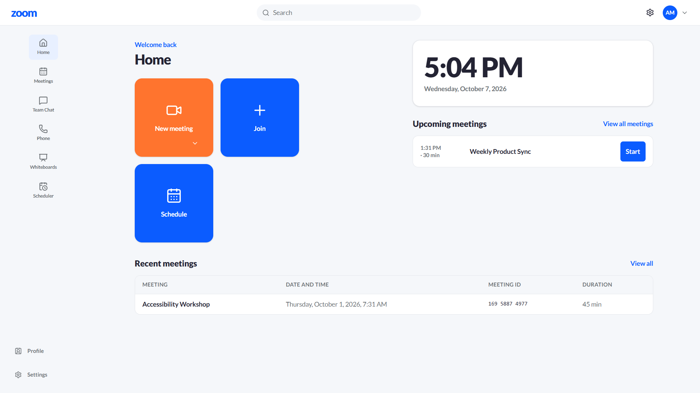 |
| Meetings | 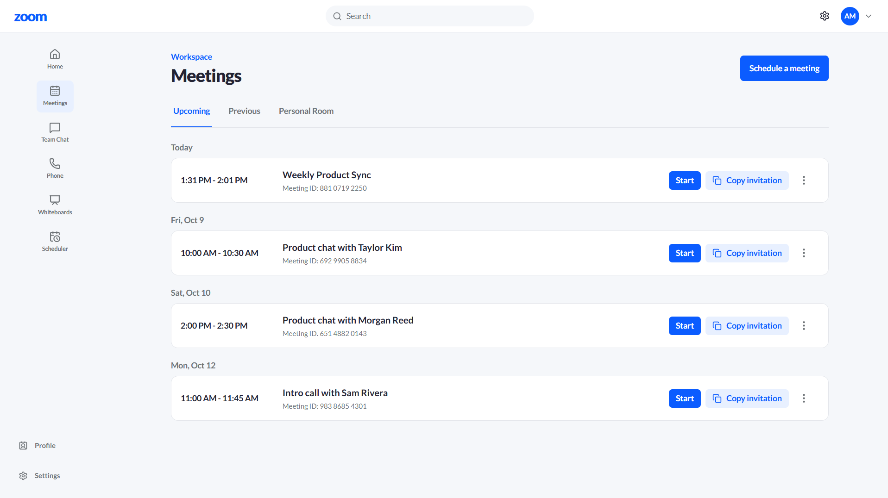 |
| Join | 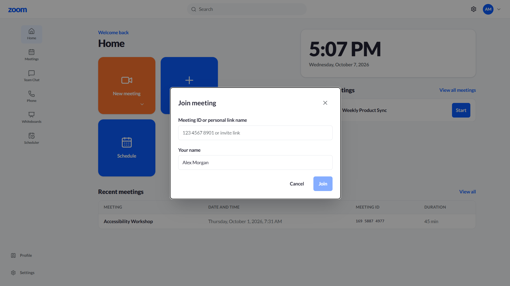 |
| Meeting room | 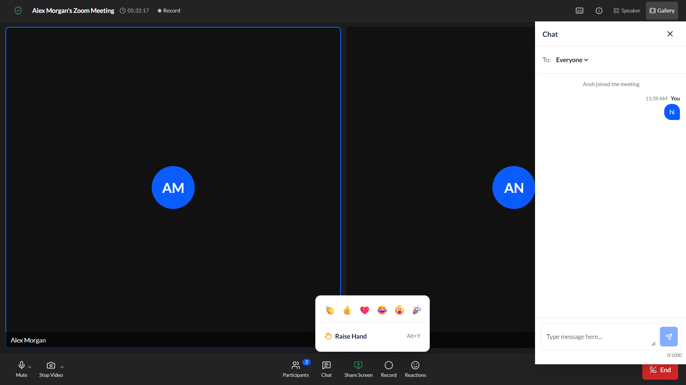 |
| Settings | 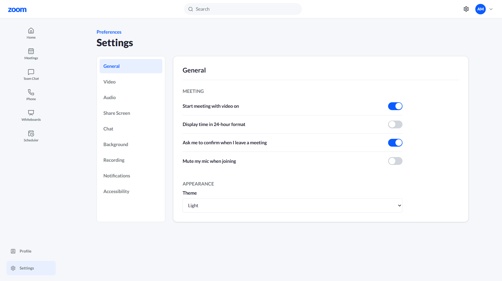 |
| Profile | 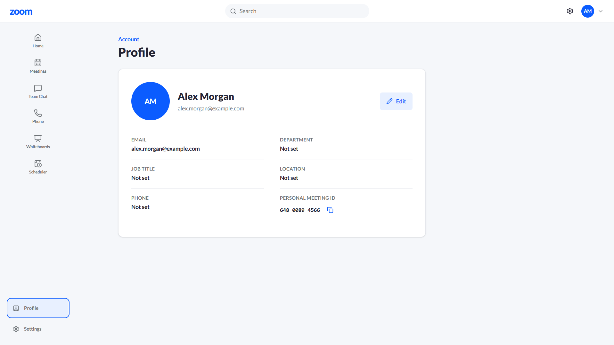 |
| Whiteboards and editor | 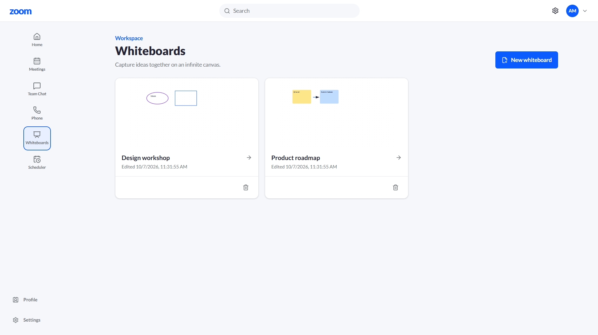 |
| Team Chat |  |
| Phone | 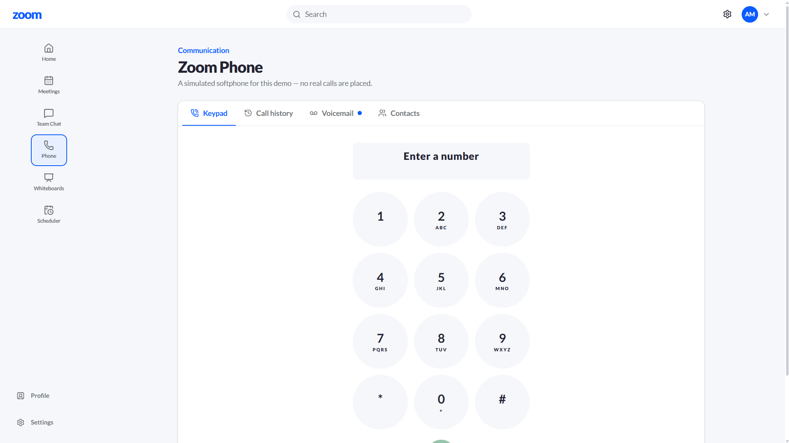 |
| Scheduler and public booking | 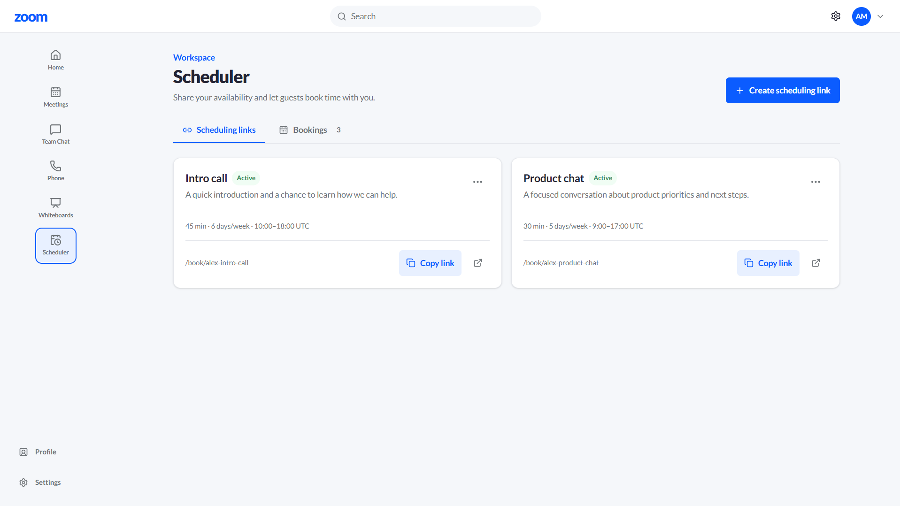 |

## Features

### Core requirements

- [x] Home dashboard with a local clock, upcoming meetings, and recent meetings.
- [x] Create an instant meeting and enter its meeting room.
- [ ] Complete browser join by ID or invite link. Code parsing, existence validation, and required display-name controls exist, but the current UI cannot reliably pass the meeting passcode as described below.
- [x] Backend join endpoint validates the meeting passcode and creates a participant when supplied with a display name.
- [x] Schedule meetings with a title, description, start time, time zone, and duration.
- [x] View upcoming and recent meetings; edit and cancel scheduled meetings.
- [x] Seeded users, meetings, whiteboards, Team Chat conversations, Phone data, and Scheduler links/bookings.

### Bonus

- [x] Responsive portal and meeting-room layouts.
- [x] Host controls for muting all participants, removing participants, lowering raised hands, locking a meeting, and enabling or disabling chat.
- [x] Camera and microphone controls, screen sharing, speaker/gallery views, local recording, live captions where browser speech-recognition APIs are available, and meeting information.
- [x] Reactions, raise hand, meeting chat, and a shared meeting whiteboard.
- [x] WebRTC peer-to-peer media with WebSocket signaling.

### Extra features

- [x] Meeting chat with polling, system join/leave messages, and unread counts.
- [x] User profile editing and persisted settings.
- [x] Personal and meeting whiteboards with drawing tools and autosave.
- [x] Team Chat channels, direct messages, replies, editing, and deletion.
- [x] Zoom Phone-style keypad, call history, voicemail, and contacts. Calls are simulated and do not connect to a telephone network.
- [x] Scheduling links, availability slots, bookings, and a generated meeting for each booking.
- [x] Optional email/password signup and login with JWT bearer tokens; the seeded default user remains available without signing in.

## Tech stack

Versions below come from `frontend/package.json` and `backend/requirements.txt`. Python and Node runtime minimums are stated separately under Getting started.

| Layer | Technology | Version | Purpose |
|---|---|---:|---|
| Frontend framework | Next.js | `^16.3.8` | App Router pages and production frontend |
| Frontend UI | React / React DOM | `^19.3.0` | Client-side UI and interactions |
| Frontend language | TypeScript | `^6.0.3` | Typed frontend source |
| Styling | Tailwind CSS | `^4.3.3` | Responsive styling |
| Icons | lucide-react | `^1.52.0` | Interface icons |
| Frontend utilities | clsx | `^2.1.1` | Conditional class names |
| Backend framework | FastAPI | `0.142.2` | HTTP and WebSocket API |
| ASGI server | Uvicorn | `0.54.0` | Serves the API |
| ORM | SQLAlchemy | `2.1.3` | Database models and persistence |
| Validation/settings | Pydantic / pydantic-settings | `2.13.5` / `2.15.0` | Request/response validation and environment configuration |
| Database | SQLite | Python standard-library driver | Local/default persistence |
| Authentication | python-jose, passlib, bcrypt | `3.5.0`, `1.7.4`, `4.0.1` | JWT tokens and password hashing |
| Backend tests | pytest / httpx | `9.1.1` / `0.28.1` | API tests and reusable smoke test |
| Frontend tests | Vitest / React Testing Library | `5.0.3` / `16.3.3` | Frontend tests |

## Architecture

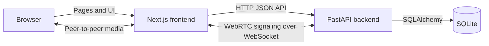

The backend separates HTTP routing from business logic: **routers** define endpoints and translate service errors, **services** implement application rules, **models** map database tables, and **schemas** validate request and response data. The **core** package holds configuration and shared rules; **db** configures SQLAlchemy; **utils** contains meeting-ID and time helpers.

The frontend uses Next.js App Router pages under `frontend/src/app`, reusable screen and UI components under `frontend/src/components`, browser/media and data hooks under `frontend/src/hooks`, and API helpers, types, constants, and formatting helpers under `frontend/src/lib`.

## Database design

The diagram reflects the SQLAlchemy models. `TeamChannel` maps to the database table `channels`.

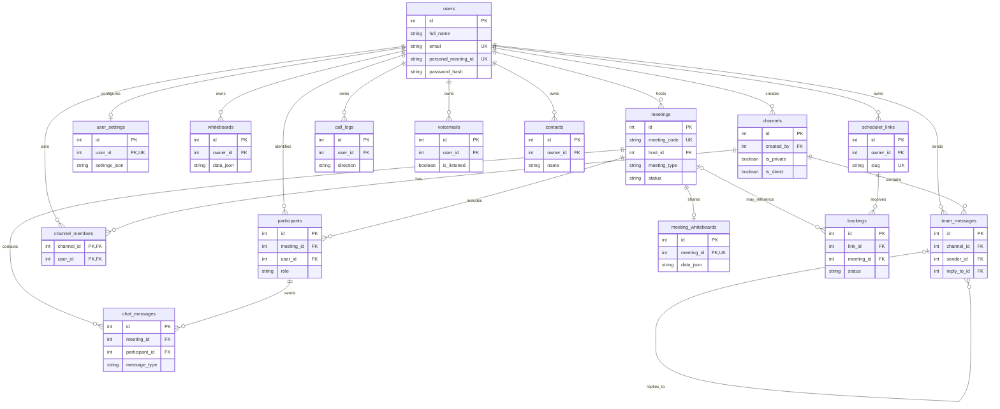

| Table | Purpose |
|---|---|
| `users` | Default and registered user profiles, credentials, and personal meeting IDs |
| `meetings` | Scheduled or instant meetings, status, access settings, and host |
| `participants` | Meeting membership, role, media state, hand state, and latest reaction |
| `chat_messages` | Meeting chat and system messages |
| `user_settings` | One validated JSON settings document per user |
| `whiteboards` | User-owned whiteboard documents |
| `meeting_whiteboards` | Shared drawing state, limited to one board per meeting |
| `channels` | Team Chat public/private channels and direct conversations |
| `channel_members` | Composite-key membership between users and channels |
| `team_messages` | Team Chat messages and optional self-referential reply target |
| `scheduler_links` | Availability rules and public slugs owned by a user |
| `bookings` | Guest appointment bookings and optional generated meeting |
| `call_logs` | Simulated call history |
| `voicemails` | Simulated voicemail metadata and transcript |
| `contacts` | Phone contacts for a user |

Email, personal meeting ID, meeting code, scheduler slug, settings user ID, and meeting-whiteboard meeting ID are unique. Meeting code, participant/host IDs, selected ownership columns, dates, channel names, and message timestamps are indexed where declared. `channel_members` uses `(channel_id, user_id)` as its composite primary key. Meeting type/status and participant role are SQLAlchemy enums; call direction and several feature statuses are validated or represented as strings rather than database enums. SQLite foreign-key enforcement is enabled on connections. Some ownership and child relationships use cascading deletion.

## API reference

All HTTP routes below are defined by the FastAPI routers. `{code}`, `{id}`, and `{slug}` are path parameters. The meeting-room signaling endpoint is a WebSocket rather than an HTTP route.

| Method | Path | Description |
|---|---|---|
| GET | `/api/health` | Lightweight API health response |
| POST | `/api/auth/signup` | Create an account and return a JWT |
| POST | `/api/auth/login` | Authenticate and return a JWT |
| GET | `/api/users` | List users for Team Chat |
| GET | `/api/users/me` | Get the current user |
| PATCH | `/api/users/me` | Update the current user's profile |
| GET | `/api/users/me/settings` | Get user settings |
| PUT | `/api/users/me/settings` | Replace and save user settings |
| POST | `/api/meetings/instant` | Create an instant meeting |
| POST | `/api/meetings/schedule` | Schedule a future meeting |
| GET | `/api/meetings?type=upcoming` or `?type=recent` | List hosted upcoming or recent meetings |
| GET | `/api/meetings/{code}` | Get meeting details |
| GET | `/api/meetings/{code}/validate` | Check whether a meeting exists |
| PATCH | `/api/meetings/{code}` | Update meeting details or status |
| PATCH | `/api/meetings/{code}/security` | Update meeting lock/chat settings (participant header required) |
| DELETE | `/api/meetings/{code}` | Cancel a meeting |
| POST | `/api/meetings/{code}/join` | Join a meeting |
| POST | `/api/meetings/{code}/leave` | Leave a meeting |
| POST | `/api/meetings/{code}/end` | End a meeting as its host |
| GET | `/api/meetings/{code}/participants` | List active participants |
| POST | `/api/meetings/{code}/mute-all` | Mute active non-host participants |
| DELETE | `/api/meetings/{code}/participants/{participant_id}` | Remove a participant |
| PATCH | `/api/meetings/{code}/participants/{participant_id}/media` | Update participant mute/video state |
| PATCH | `/api/meetings/{code}/participants/{participant_id}/hand` | Raise or lower a participant's hand |
| POST | `/api/meetings/{code}/participants/{participant_id}/reaction` | Set a participant reaction |
| GET | `/api/meetings/{code}/chat` | List meeting chat; supports `after_id` |
| POST | `/api/meetings/{code}/chat` | Send meeting chat as `X-Participant-Id` |
| GET | `/api/meetings/{code}/whiteboard` | Read meeting-shared whiteboard |
| PUT | `/api/meetings/{code}/whiteboard` | Save meeting-shared whiteboard |
| GET | `/api/whiteboards` | List the current user's whiteboards |
| POST | `/api/whiteboards` | Create a whiteboard |
| GET | `/api/whiteboards/{board_id}` | Read an owned whiteboard |
| PATCH | `/api/whiteboards/{board_id}` | Update an owned whiteboard |
| DELETE | `/api/whiteboards/{board_id}` | Delete an owned whiteboard |
| GET | `/api/chat/channels` | List Team Chat channels and conversations |
| POST | `/api/chat/channels` | Create a Team Chat channel |
| GET | `/api/chat/channels/{channel_id}/messages` | List channel messages; supports `after_id` |
| POST | `/api/chat/channels/{channel_id}/messages` | Send a Team Chat message |
| PATCH | `/api/chat/messages/{message_id}` | Edit a message sent by the current user |
| DELETE | `/api/chat/messages/{message_id}` | Delete a message sent by the current user |
| POST | `/api/chat/dm` | Get or create a direct conversation |
| GET | `/api/phone/call-logs` | List simulated call logs |
| POST | `/api/phone/call-logs` | Save a simulated call log |
| GET | `/api/phone/voicemails` | List simulated voicemails |
| PATCH | `/api/phone/voicemails/{voicemail_id}` | Update voicemail listened state |
| GET | `/api/phone/contacts` | List contacts |
| POST | `/api/phone/contacts` | Create a contact |
| PATCH | `/api/phone/contacts/{contact_id}` | Update a contact |
| DELETE | `/api/phone/contacts/{contact_id}` | Delete a contact |
| GET | `/api/scheduler/links` | List owned scheduling links |
| POST | `/api/scheduler/links` | Create a scheduling link |
| PATCH | `/api/scheduler/links/{link_id}` | Update a scheduling link |
| DELETE | `/api/scheduler/links/{link_id}` | Delete a scheduling link |
| GET | `/api/scheduler/bookings` | List upcoming bookings |
| GET | `/api/scheduler/public/{slug}` | Get public scheduling-link details |
| GET | `/api/scheduler/public/{slug}/slots?date=YYYY-MM-DD` | List available slots for a date |
| POST | `/api/scheduler/public/{slug}/book` | Book a slot and create a scheduled meeting |
| WebSocket | `/ws/meetings/{code}?participant_id={id}` | Relay WebRTC signaling between participants |

Interactive API documentation is available at `/docs` on the running backend; the OpenAPI schema is at `/openapi.json`.

## Getting started

### Prerequisites

- Python 3.11 or later. The code uses `StrEnum` and is intended for Python 3.11+.
- Node.js 20.9 or later and npm. Next.js 16 requires Node.js 20.9 or later.
- Git.

### Clone the repository

```sh
git clone <repository-url>
cd <repository-directory>
```

### Backend

Run these commands from the repository root in a new terminal.

**Windows PowerShell**

```powershell
cd backend
py -3.11 -m venv .venv
.\.venv\Scripts\Activate.ps1
Copy-Item .env.example .env
pip install -r requirements.txt
```

**macOS or Linux**

```sh
cd backend
python3.11 -m venv .venv
source .venv/bin/activate
cp .env.example .env
pip install -r requirements.txt
```

Edit `backend/.env` for local development: set `FRONTEND_URL` to the frontend origin, and keep `DATABASE_URL=sqlite:///./zoom.db` to use the local SQLite file. Start the API while the current directory is `backend`:

```sh
uvicorn app.main:app --host 0.0.0.0 --port 8000
```

### Frontend

Open a second terminal from the repository root.

**Windows PowerShell**

```powershell
cd frontend
Copy-Item .env.example .env.local
npm ci
```

**macOS or Linux**

```sh
cd frontend
cp .env.example .env.local
npm ci
```

Set `NEXT_PUBLIC_API_URL=http://localhost:8000` and `NEXT_PUBLIC_WS_URL=ws://localhost:8000` in `frontend/.env.local` for local API and signaling. Then run:

```sh
npm run dev
```

Open the frontend at `http://localhost:3000`, the API at `http://localhost:8000`, and interactive API documentation at `http://localhost:8000/docs`.

### Seeding and database reset

At application startup, SQLAlchemy creates tables. If `users` is empty, startup seeds six sample users, meeting history and upcoming meetings, settings, two whiteboards, Team Chat data, simulated Phone data, and Scheduler links and bookings. If users already exist, startup still attempts the auxiliary whiteboard, Team Chat, Phone, and Scheduler seeds; these seed routines avoid adding their sample data again when it is already present.

To reset the local database, stop the backend first and remove `backend/zoom.db`. This permanently deletes local data; the next startup recreates the schema and seed data.

**Windows PowerShell, from the repository root**

```powershell
Remove-Item .\backend\zoom.db
```

**macOS or Linux, from the repository root**

```sh
rm ./backend/zoom.db
```

The application uses `create_all` plus a few startup `ALTER TABLE` compatibility changes; it does not include a general migration framework. For a clean schema after model changes, use a fresh database.

### Tests and checks

**Backend, from `backend` with its virtual environment active**

```sh
pytest
python scripts/smoke_test.py --base-url http://localhost:8000
```

The smoke script exercises health, meeting creation/scheduling, validation/listing, joining as guests, chat, host mute/remove, and ending a meeting. It accepts a deployed API URL using the same `--base-url` option.

**Frontend, from `frontend`**

```sh
npm run test
npm run lint
npx tsc --noEmit
npm run build
```

## Environment variables

Backend settings are loaded from the environment or `backend/.env`. Frontend `NEXT_PUBLIC_*` values are exposed to the browser and should be set before building for deployment.

| Application | Name | Description | Example |
|---|---|---|---|
| Backend | `DATABASE_URL` | SQLAlchemy database connection URL | `sqlite:///./zoom.db` |
| Backend | `FRONTEND_URL` | Primary frontend origin allowed by CORS; required | `https://frontend.example.com` |
| Backend | `CORS_ORIGINS` | Optional extra CORS origins encoded as a JSON array | `["https://preview.example.com"]` |
| Backend | `JWT_SECRET` | Secret used to sign login tokens; configure a unique secret in deployed environments | `replace-with-a-random-secret` |
| Backend | `JWT_ALGORITHM` | JWT signing algorithm | `HS256` |
| Backend | `JWT_EXPIRY_HOURS` | Bearer token lifetime in hours | `24` |
| Frontend | `NEXT_PUBLIC_API_URL` | Required base URL for HTTP API calls | `https://api.example.com` |
| Frontend | `NEXT_PUBLIC_WS_URL` | WebSocket URL for meeting signaling; derived from API URL if omitted | `wss://api.example.com` |
| Frontend | `NEXT_PUBLIC_STUN_SERVER_URL` | Optional STUN server URL for WebRTC peer connections | `stun:stun.l.google.com:19302` |
| Frontend | `NEXT_PUBLIC_TURN_SERVER_URL` | Optional TURN relay URL for restrictive networks | `turn:turn.example.com:3478` |
| Frontend | `NEXT_PUBLIC_TURN_USERNAME` | Optional short-lived TURN username; sent to browsers | Provider-issued temporary username |
| Frontend | `NEXT_PUBLIC_TURN_CREDENTIAL` | Optional short-lived TURN credential; sent to browsers | Provider-issued temporary credential |

The backend also allows HTTPS `*.vercel.app` origins through a constrained CORS regular expression. The checked-in `.env.example` files use safe example values; replace them with deployment-specific values.

## Assumptions and design decisions

- **Identity:** No sign-in is required to use the default seeded account (user ID `1`). Signup and login endpoints and pages also exist; when a valid bearer token is supplied, the API resolves the authenticated user.
- **Meeting IDs:** New meeting IDs are unique, random 11-digit strings stored without spaces and formatted as `3-4-4` groups for display. The user's personal meeting ID is reused when the personal-room option is selected.
- **Invite links:** The join page is `/j/{meeting_code}` and accepts a passcode in the `pwd` query parameter. **Current implementation discrepancy:** the backend invite-link helper returns a literal `?******` marker instead of `?pwd={passcode}`. The join modal also drops query parameters when it converts an invite URL to the pre-join route, and the pre-join screen has no passcode field. As a result, a passcode-protected meeting cannot reliably be joined through the current UI. Fix and verify this flow before relying on invite links.
- **Time:** Scheduled meeting and booking timestamps are normalized to UTC by services and the frontend formats dates using browser-local date/time APIs. Scheduler availability uses the link's configured time zone.
- **Live updates:** Meeting participants, chat, Team Chat, and collaborative whiteboard state use periodic polling (meeting chat and meeting whiteboard poll every two seconds; meeting participant state uses a three-second interval). Polling is straightforward for a small demo but adds request traffic and can show updates later than a persistent event connection. WebSockets are used for WebRTC signaling only.
- **Media:** Camera, microphone, and screen capture depend on browser media APIs, permissions, and a secure context (HTTPS, or localhost). A shared screen is sent on a dedicated WebRTC track and shown as the main stage with participant thumbnails; only one participant may share at a time. WebSocket signaling and active-share state are kept in backend process memory, so horizontally scaled backend instances require a shared signaling service. WebRTC also uses STUN and optionally a TURN relay. STUN-only connections may fail across restrictive NATs or firewalls; configure a TURN provider for reliable deployment coverage. TURN credentials are exposed to clients, so use provider-issued short-lived credentials rather than a permanent secret.
- **Simulated behavior:** Zoom Phone is explicitly a softphone simulation: it does not place real calls and voicemail playback is a UI simulation. A direct Team Chat conversation can receive a delayed automated sample reply when the seeded default user sends a message; this is not a live teammate or external messaging integration. Several settings such as cloud recording, remote control, and notification preferences are persisted controls, not integrations with external services.
- **Hosting:** Free hosting plans may sleep and take time to wake. SQLite stored on an ephemeral deployment filesystem can be reset when an instance is restarted or redeployed; use persistent storage or a managed database if data must survive deployments. Startup seeding repopulates empty tables.

## Deployment

### Backend on Render

Create a Python web service with the **Root Directory** set to `backend`.

```text
Build Command: pip install -r requirements.txt
Start Command: uvicorn app.main:app --host 0.0.0.0 --port $PORT
```

Configure `DATABASE_URL`, `FRONTEND_URL`, and a unique `JWT_SECRET`; configure `JWT_ALGORITHM`, `JWT_EXPIRY_HOURS`, and `CORS_ORIGINS` if needed. `FRONTEND_URL` should be the deployed frontend origin. For SQLite persistence, attach a persistent disk and point `DATABASE_URL` at its mounted file. SQLite on an ephemeral free-tier filesystem is not durable.

### Frontend on Vercel

Import the repository as a Next.js application with the **Root Directory** set to `frontend`. Use `npm run build` as the build command; Vercel runs the Next.js application on its managed platform. Set `NEXT_PUBLIC_API_URL` to the deployed backend base URL and set `NEXT_PUBLIC_WS_URL` to its `wss://` signaling URL. `NEXT_PUBLIC_STUN_SERVER_URL` is optional. For restrictive networks, also set the TURN URL and short-lived credentials using `NEXT_PUBLIC_TURN_SERVER_URL`, `NEXT_PUBLIC_TURN_USERNAME`, and `NEXT_PUBLIC_TURN_CREDENTIAL`. These public values must be present when the frontend build runs.

For self-hosting the built frontend, the available package commands are:

```sh
npm run build
npm run start
```

## Project structure

```text
.
├── .github/
│   └── copilot-instructions.md  Workspace-specific coding context
├── backend/
│   ├── app/
│   │   ├── core/                Configuration, constants, auth, and domain errors
│   │   ├── db/                  SQLAlchemy base, engine, and sessions
│   │   ├── models/              Database table models
│   │   ├── routers/             HTTP and WebSocket route handlers
│   │   ├── schemas/             Pydantic request and response schemas
│   │   ├── services/            Meeting, chat, profile, and feature logic
│   │   ├── utils/               Meeting ID and UTC time helpers
│   │   ├── main.py              FastAPI app, startup, CORS, and health route
│   │   └── seed.py              Initial and feature sample data
│   ├── scripts/smoke_test.py    Reusable live API smoke test
│   ├── tests/                   Pytest API and behavior tests
│   ├── .env.example             Backend environment template
│   └── requirements.txt         Pinned Python dependencies
├── docs/
│   └── screenshots/
│       └── placeholder.svg      Shared placeholder for screenshot entries
└── frontend/
    ├── src/app/                 App Router pages and route layouts
    ├── src/components/          Screen, layout, meeting, and UI components
    ├── src/hooks/               Meeting, media, polling, and recording hooks
    ├── src/lib/                 API client, types, constants, and utilities
    ├── src/test/                Frontend test setup
    ├── .env.example             Frontend environment template
    ├── package.json             Frontend scripts and dependencies
    └── vitest.config.mts        Vitest configuration
```

Frontend routes include `/`, `/meetings`, `/schedule`, `/settings`, `/profile`, `/team-chat`, `/phone`, `/whiteboards`, `/whiteboards/[id]`, `/scheduler`, `/book/[slug]`, `/j/[code]`, `/meeting/[code]`, `/meeting/[code]/ended`, `/login`, `/signup`, and `/signed-out`.

## Author

- Name: Ashish Ranjan
- GitHub: [https://github.com/Ashish-1506](https://github.com/Ashish-1506)
- LinkedIn: [https://www.linkedin.com/in/ashish-ranjan-966986289](https://www.linkedin.com/in/ashish-ranjan-966986289)
